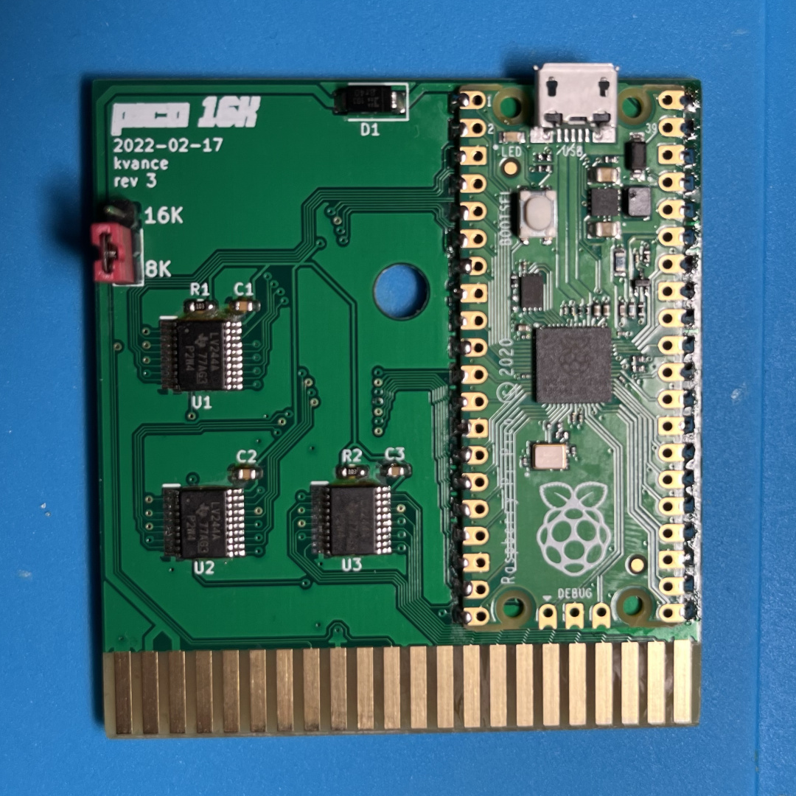
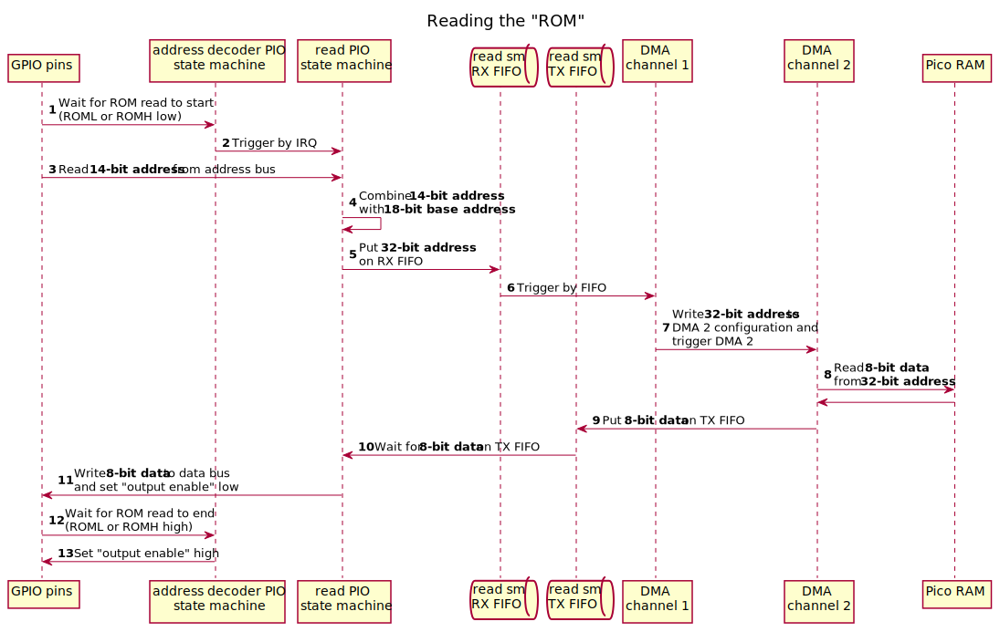
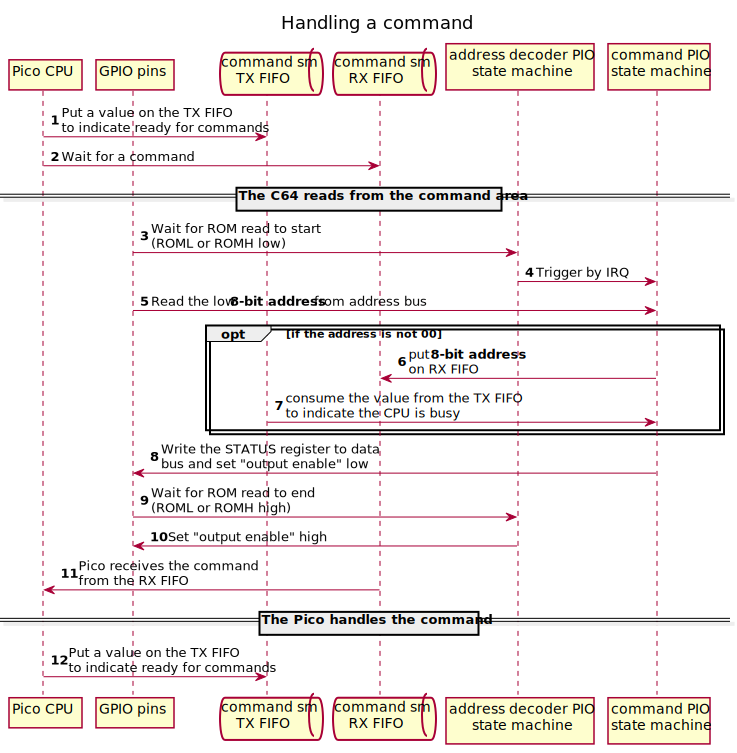

# Commodore 64 to Raspberry Pi Pico RAM interface

This project exposes a 16 KiB window of a Raspberry Pi Pico's RAM to a Commodore 64 via the
expansion port. It includes a hardware design and software for the Pico C++ SDK.

<table style="border-collapse: collapse"><tr>
<td><figure>
<figcaption>PCB image</figcaption></figure></td>
<td><figure>
<figcaption>Demo video</figcaption></figure>
</tr></table>

## The hardware

**[Schematic PDF](./docs/schematic.pdf)**

Schematic, PCB, and project files are in KiCad 6 format.

5V power from the expansion port is used to power the Pico. As suggested in the Pico datasheet,
a Schottky diode allows the Pico to be connected to powered USB at the same time. 

8-bit buffers bring the 5V logic levels on the address and data bus down to 3.3V to protect
the Pico's GPIO pins. This means that when the C64 reads from the Pico, it's putting a 3.3V
signal on the data bus.  At TTL logic levels, this should be fine.

A switch allows you to toggle between an 8K ROM and a 16K ROM by pulling the /GAME line low.
This loses half the address space, but lets you boot into BASIC.

The tolerances on the PCB design are compatible with [JLCPCB](https://jlcpcb.com/). I ordered
my prototypes from them with ENIG surface finish and gold fingers on a 1.6mm thick board.  You
can get them made much cheaper with HASL, but it will eventually scrape off as you reinsert
the board.

## The firmware

Given a 16 KiB-aligned base address on the Pico's address space, four PIO state machines and
two DMA channels handle reading addresses from the C64 address bus and writing the requested
data to the C64 data bus. The CPU is not needed once this is configured.

To allow the C64 to communicate with the Pico, a 256 byte **command area** is reserved that
will put that byte onto the RX FIFO for the CPU to consume.  The CPU can put any value onto
the TX FIFO to signal that it is ready for more commands.

Between the GPIO pins and the RAM, there are four logical components:

- **address_decoder PIO state machine:** monitors the /ROML and /ROMH lines for reads,
  checks if the address is for the special **command area**, and wakes up either the **read**
  or **command** state machines as needed.  Two copies of this state machine run at the same
  time, monitoring /ROML and /ROMH.
- **read PIO state machine:** reads the address lines, sends the address to DMA, and writes
  the returned data to the data bus
- **command PIO state machine:** reads the low 8 bits of the address, and copies it to the
  RX FIFO for the CPU to handle.  It writes the STATUS register back to the data bus, indicating
  if the CPU is busy or not. The CPU can indicate its readiness by writing any value to the TX FIFO.

  The special value `00` will not be sent to the CPU at all, allowing the C64 to poll the status
  register until the Pico is finished processing a command.
- **DMA channel 1**: write the incoming address to the configuration of DMA channel 2, triggering
  a read
- **DMA channel 2**: copy a byte at the requested RAM address to the read PIO state machine

It's a Rube Goldberg machine, but the Pico's PIO controllers and DMA can do this in well under
the time required by the C64's CPU.

## Further improvements

### Could this work as a 16K ROM and IO ports?

Maybe, but this design is already using all the GPIO pins on the Pico.  Even if you replace
the "input enable" pin (you can probably get away without it), you'll also need to monitor
PHI2.  In my experience, the IO lines are glitchy and you need to make sure that you're actually
in the right part of the clock cycle to use them.

You could try using a shift register to free up a bunch of pins, but you'll waste a lot of
PIO clock cycles shifting all the bits through it.  It might be fast enough to only shift a
couple of bits.

### Could I use all 44 KiB of the available address space?

I think you're definitely in shift register territory at this point, and good luck trying to
decode more than a couple of address prefixes in PIO.  If you actually do this, please contact
me because I want to see it!

## Legal

Distribute under the terms of the BSD 3-clause license.

The [KiCad-RP-Pico footprint](https://github.com/ncarandini/KiCad-RP-Pico) is by
Nicolò Carandini.
